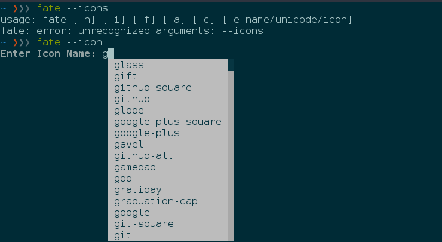
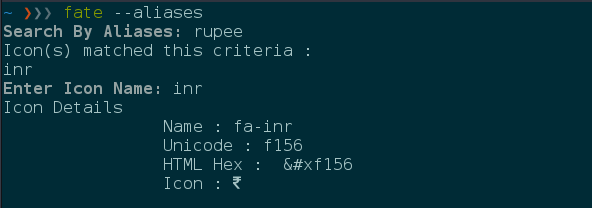

# fate

>fate is a simple CLI program which let's you browse FontAwesome icons on your terminal. 
Note : Python3+ only.

### Installation : 

> `pip install fate`

###Avilable commands : 
#### To browse all the icons.

`fate --icon `

#### To narrow down you search with FontAwesome filter tags, use --filter or -f
`fate -filter`

##### To narrow down your search with aliases tag, use --aliases or -a
`fate --aliases`

##### To narrow down your search with categories tag, use --category or -c
`fate --category`

##### To echo the icon `[name/ unicode/ html]` hex use it with -e or --echo

> Example : 

`fate -i -e name`

### What's with the name ? 

Well, 'F'ont'A'wesome on 'Te'rminal = "fate" :)
Credits to my good friend [@Kush](https://twitter.com/BurstDragon)

For the icons to display properly on your system, you need to have FontAwesome fonts installed.
Grab the otf files from [here](https://fortawesome.github.io/Font-Awesome/)
You will need to install this font on your system for icons to be rendered properly.
Instructions [here](http://askubuntu.com/questions/191778/how-to-install-many-font-files-fast-and-easy)

For Windows users : 
 - pip install would most likely fail to install `pyyaml`, since `PyYAML` isn't actively maintained. You need to grab it manaully from [here](http://www.lfd.uci.edu/~gohlke/pythonlibs/#pyyaml)
 - If you are using `cmd` god bless you. Change the character map using `chcp 65001`. Check [here](http://stackoverflow.com/questions/14109024/how-to-make-unicode-charset-in-cmd-exe-by-default) for additional instructions.

### License
> MIT © Karan Sharma 

> [LICENSE included here](LICENSE)
